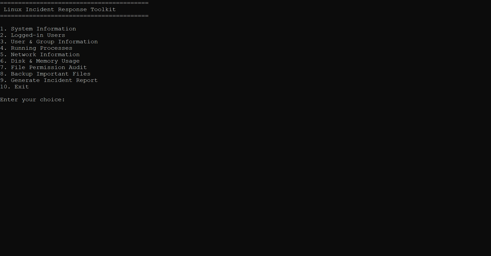
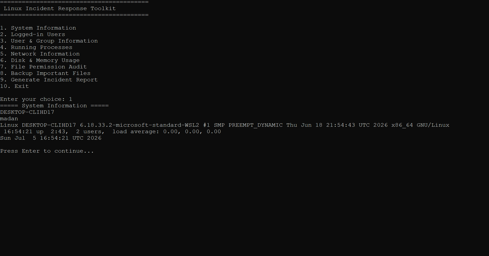
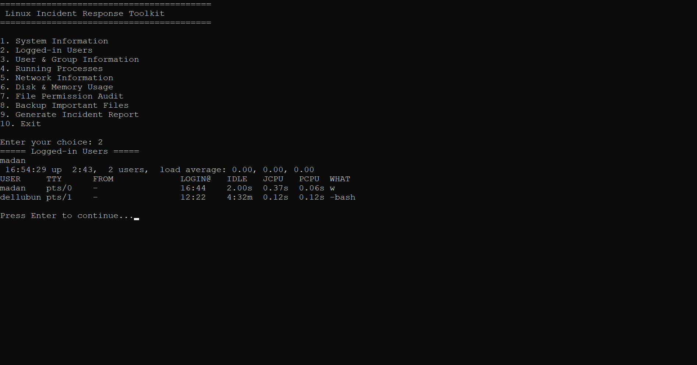
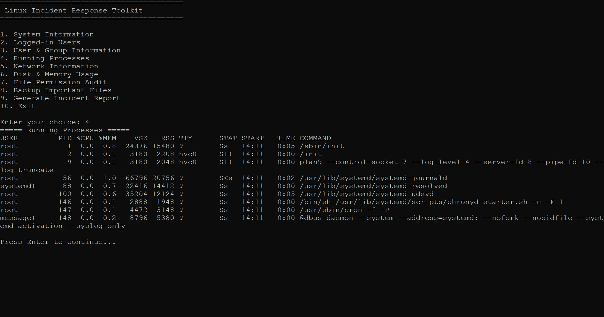
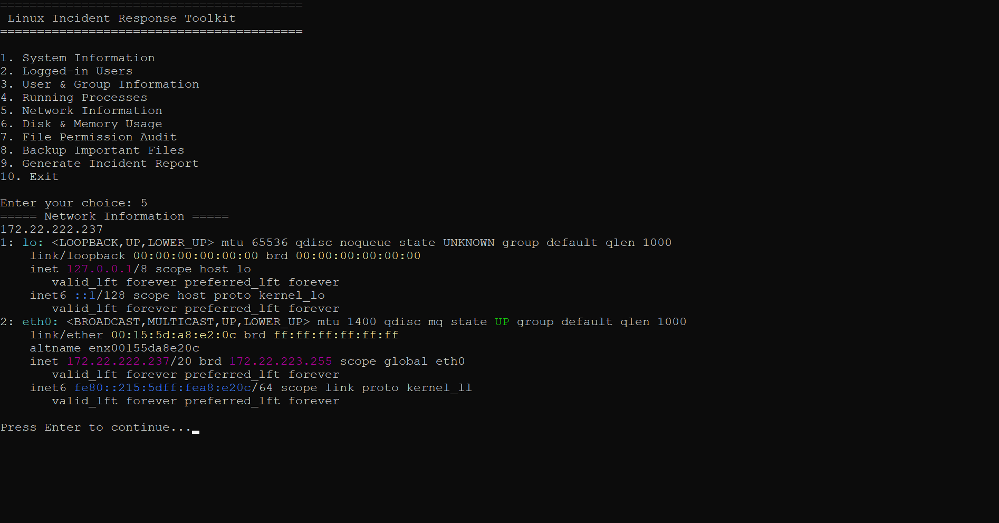
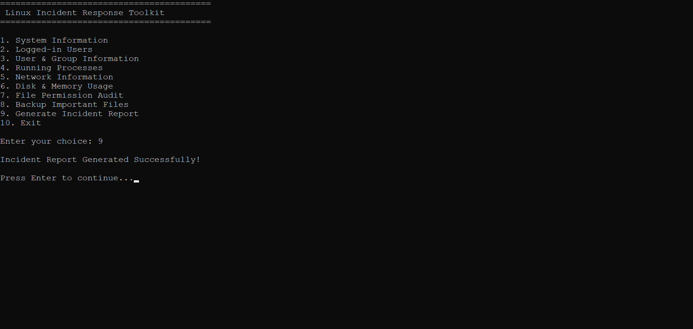

## Project Screenshots

### Main Menu

### System Information

### Logged-in Users

### Running Processes

### Network Information

### Incident Report Generated

---

## Sample Output

The repository also contains a sample generated incident report:

- `report_20260705_1659.txt`
